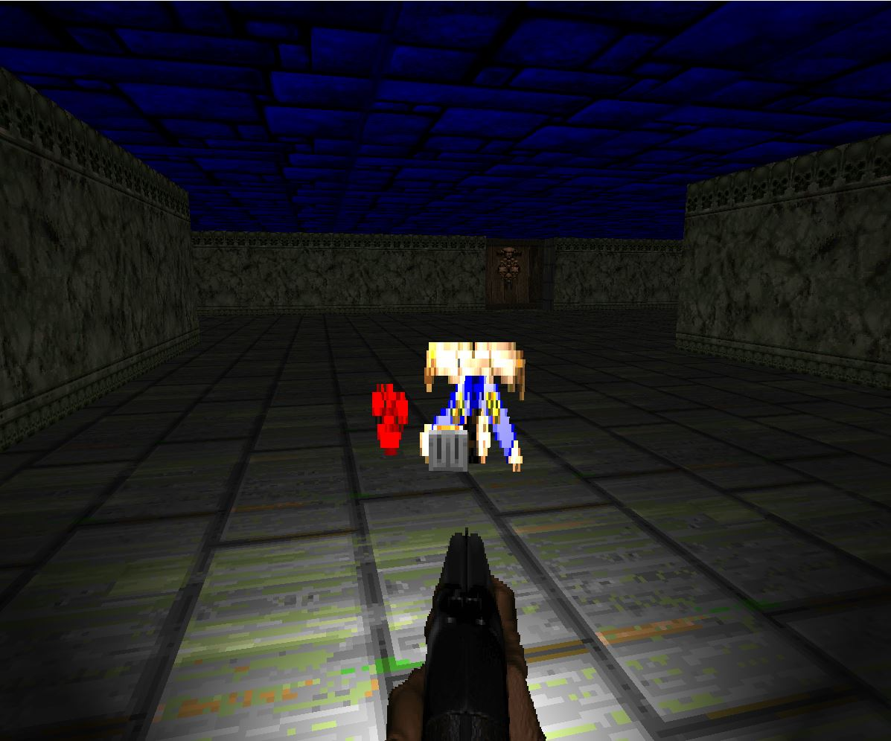
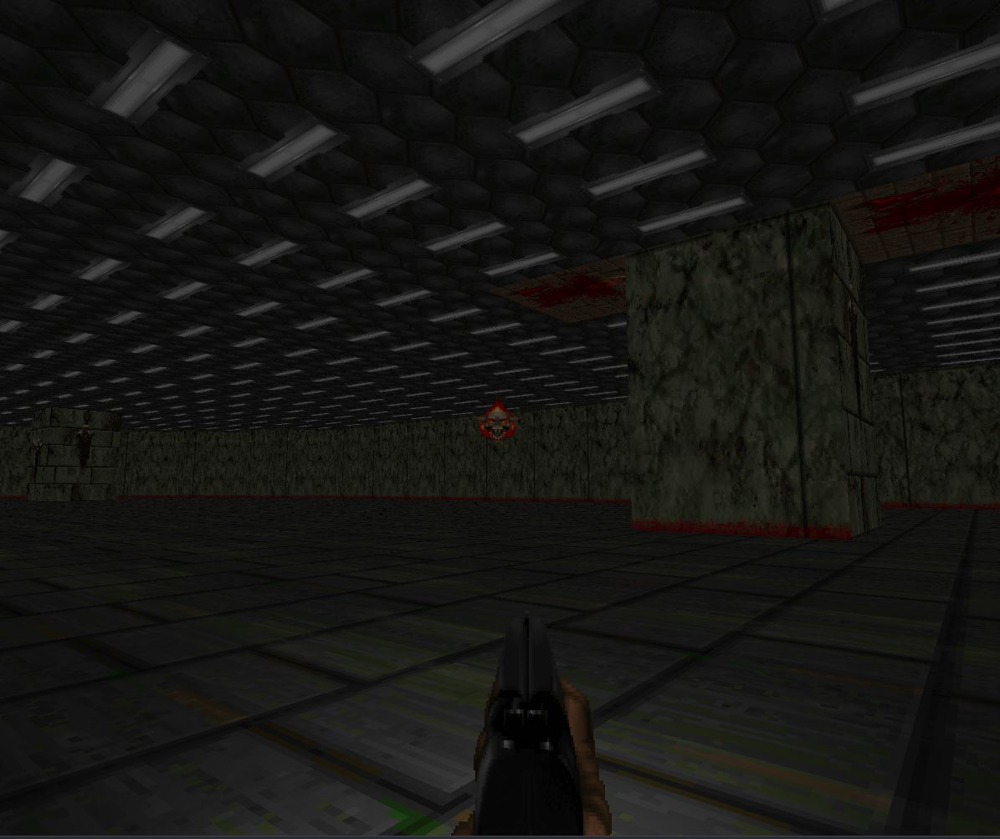
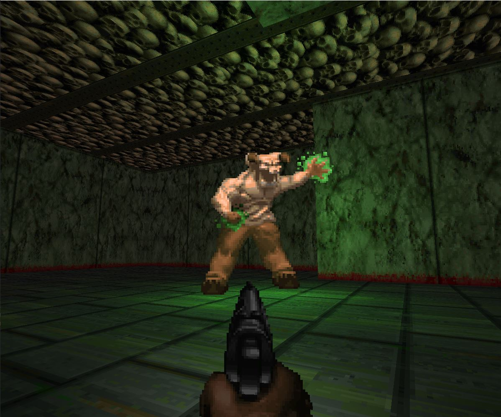

# Doom-clone
A doom clone running on the engine created in https://github.com/BKPrograms/GameEngine. Currently, it has level loading, textures (4x4 sprite sheets are ideal), 3 different enemy types,
2 distinct levels, doors, pickups (currently health and ammo), and more to come.

A dead enemy with an ammo drop in level 1:

A flying enemy that charges at you in level 2:

A tank-like enemy in level 2:

